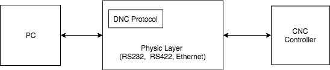

## shCNC
OpenSource CNC Software

Название проекта временное.

## Концепция

Принцип работы изображен на рисунке ниже.

Цели и задачи, которые должны быть решены:

 - Построение станка без монитора. А в качестве органа отправки задания, мониторнига использовать персональный компьютер (не зависимо с какой ОС).
 - Управлением самого станка будет занимать контроллер. Он будет интерпритировть команды - G-Code.
 - В качестве интерфейса связи между PC и CNC контроллером должен использовать стандартный физический протокол (RS232, RS422, Ethernet, и т.д.). Для непосредственного взаимодействия с контроллером используется стандартизированный протокол (DNS2). Он будет работать поверх физического слоя.
 - Программа отправки задачи не должна быть завязана на конкретный контроллер и его железо.
 - Все программное обеспечение должно быть открыто.
 - Уменьшить затраны на создание станка.
 - Иметь единое програмное обеспечение, способное работать и легко адаптироваться под любые станки, не зависящее от железа.
 
## Непосредственно данная реализация

 - В качестве железа для CNC контроллера будет использоваться FreeRTOS. Связь будет осуществляться через Virtual Com Port (over USB). На базе ARM контроллера от ST.
 - Программа для отправки задачь будет написана на Pethon3 с использованием библиотеки Pivi. Это даст кросплатформинность, а так же возможность работать с точскрин мониторами. За пример взята реализация из проекта Maslow.

## Примечание

Рисунки сделаны в draw.io.

## Links

 - [Direct numerical control (Wiki)](https://en.wikipedia.org/wiki/Direct_Numerical_Control)
 - [G-code (Wiki En)](https://en.wikipedia.org/wiki/G-code)
 - [G-code (Wiki Ru)](https://ru.wikipedia.org/wiki/G-code)
 - [Fanuc DNC 2 Description](http://www2.i-logic.com/manuals/Fanuc%20DNC%202%20Description.pdf)
 - [Universal-G-Code-Sender](https://github.com/johnlauer/Universal-G-Code-Sender)
 - [grbl](https://github.com/gnea/grbl)
 - [OpenDNC](https://github.com/AnirudhPal/OpenDNC)
 - [Maslow](http://www.maslowcnc.com/)